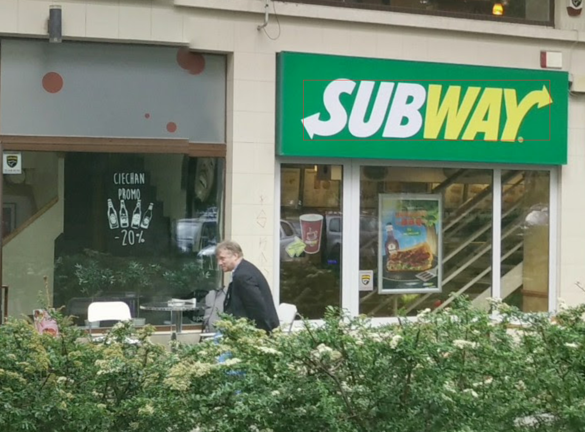
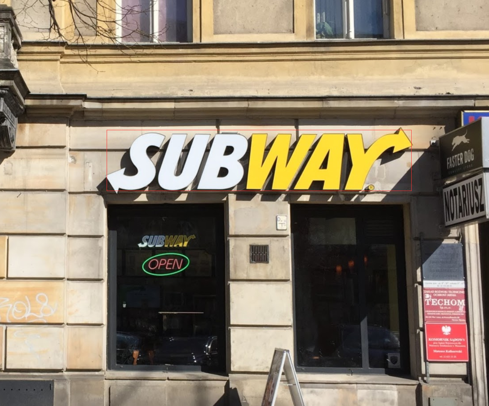
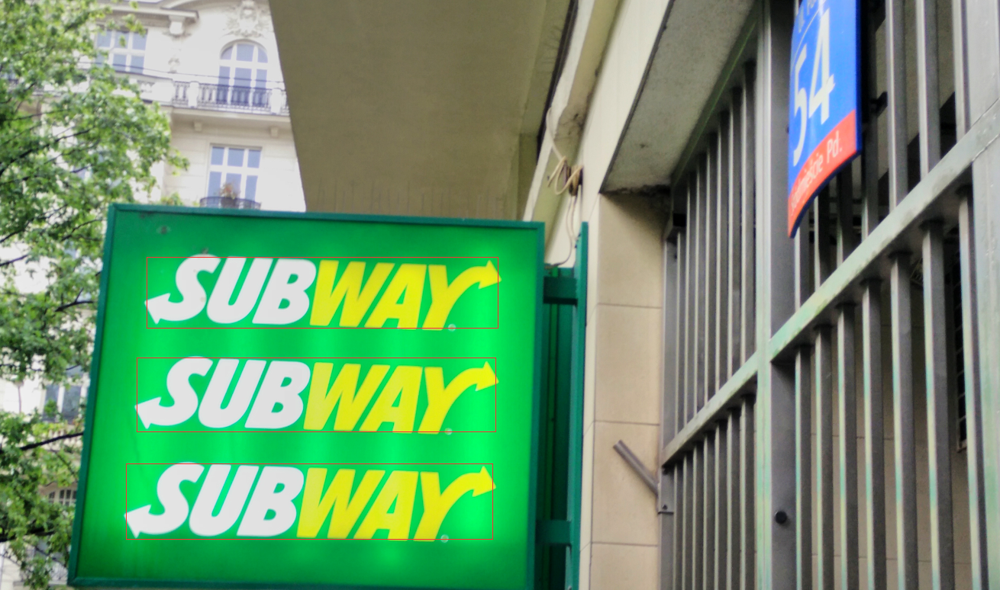
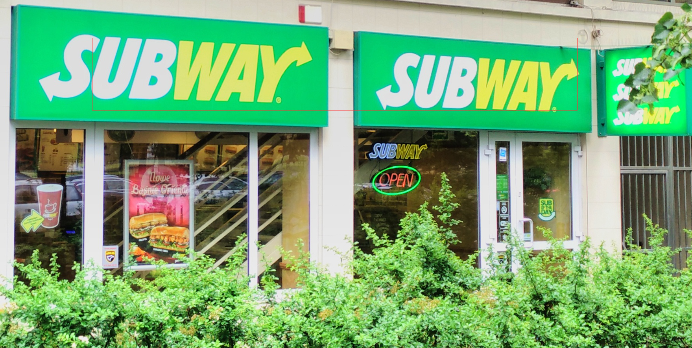
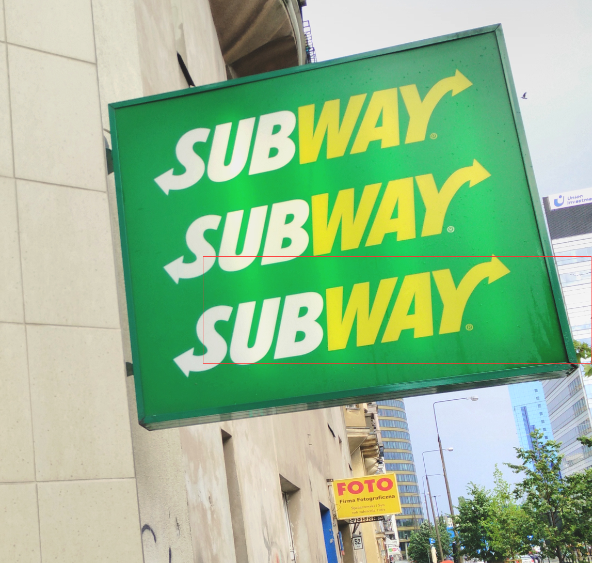
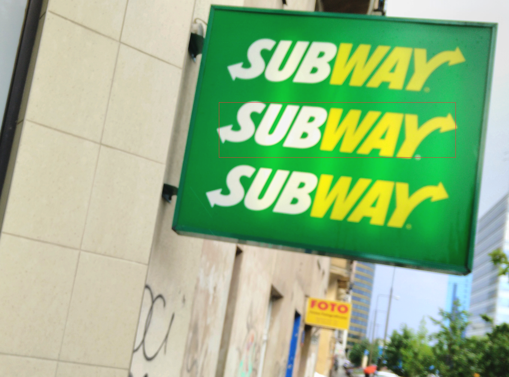
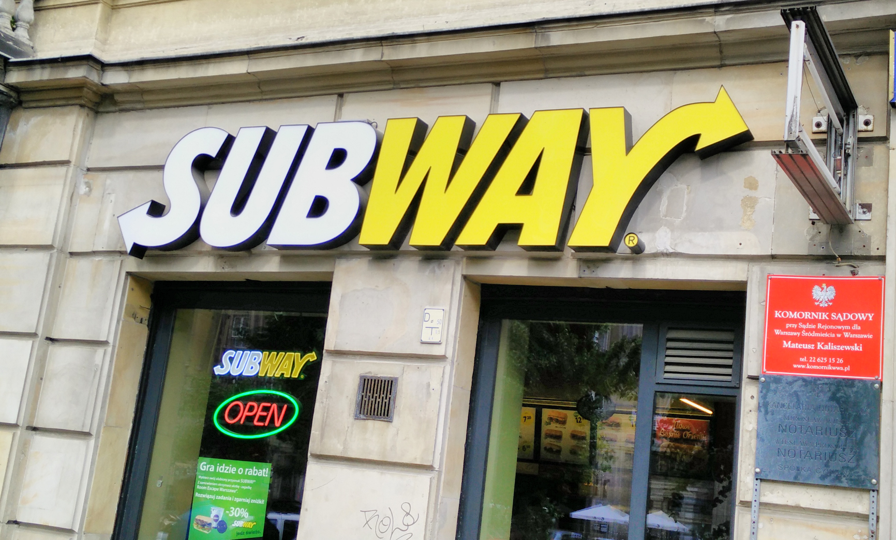
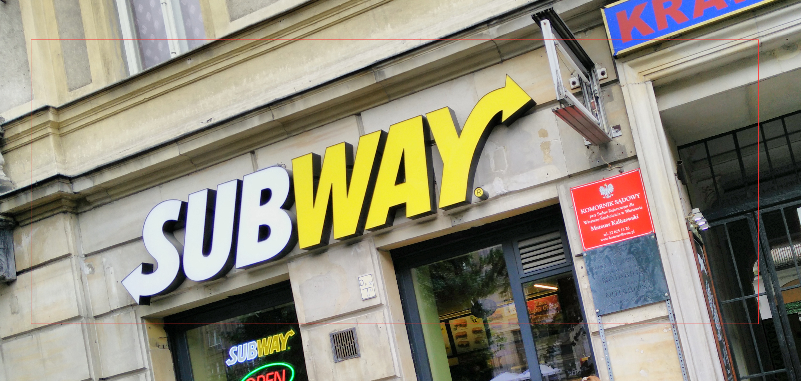

# Subway logo recognition

## Application that finds Subway logo on given images.
### Sometimes it works really fine:

### Sometimes it might be working better:

### And for crooked images it doesn't work at all:

## Check example output folder to see stages of recognition [folder](example_images_output/images)
